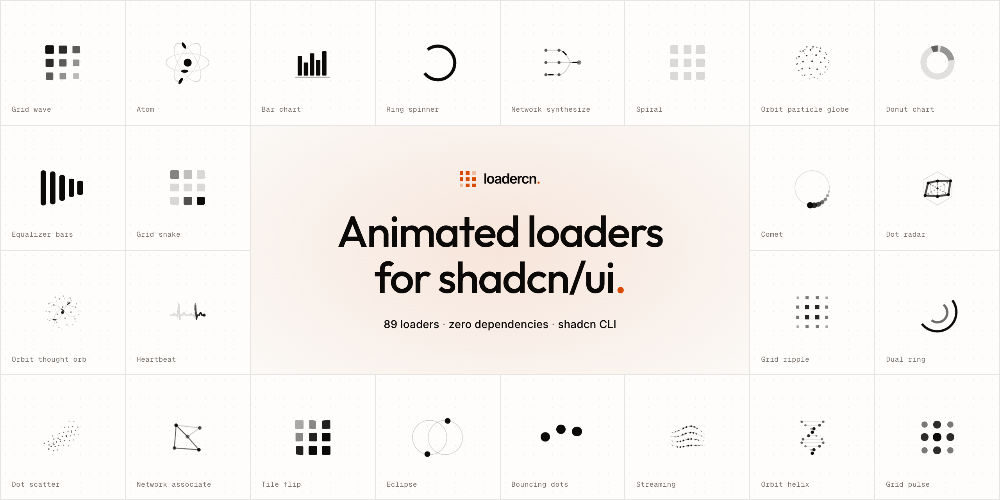

# loadercn

<a href="https://loadercn.vercel.app">
  <picture>
    <source media="(prefers-color-scheme: dark)" srcset=".github/assets/cover-dark.png" />
    
  </picture>
</a>

Animated React loaders for shadcn/ui, in five families: grid, orbital, classic, network, and chart. Each loader is a single self-contained file:

- **Zero dependencies.** Only React. No animation library, no Tailwind, no `cn`.
- **Pure CSS animation.** Keyframes ship in an inline `<style>` tag, with no JavaScript animation loop.
- **Works in any React app.** You don't need Tailwind or shadcn, and nearly every loader is server-component safe.
- **Themeable.** Loaders draw with `currentColor`, so they inherit your text color.
- **Accessible.** Each has a `role="status"` label and respects `prefers-reduced-motion`.

Browse, preview, and copy them at https://loadercn.vercel.app.

## Install

Add any loader with the shadcn CLI:

```sh
npx shadcn@latest add https://loadercn.vercel.app/r/grid-wave.json
```

Or register the `@loadercn` namespace once and add loaders by name:

```sh
npx shadcn@latest registry add @loadercn=https://loadercn.vercel.app/r/{name}.json
npx shadcn@latest add @loadercn/grid-wave
```

`npx shadcn@latest search @loadercn` lists every loader. No shadcn? Copy the source from the site. Each file needs only React.

## Usage

```tsx
import { GridWave } from "@/components/ui/grid-wave"

;<GridWave
  size={40}
  speed={1.6}
  className="text-orange-600"
  label="Loading results"
/>
```

- `size`: pixels (default `40`)
- `speed`: cycle duration in seconds, lower is faster (default `1.6`; spherical, chart, and dot-sweep loaders use `3.2` or `4.8`)
- `label`: accessible status text (default `"Loading"`)

Loaders also accept any `<span>` props.

## Contributing

See [CONTRIBUTING.md](CONTRIBUTING.md) for local setup and how to add a loader.

## Authors

<a href="https://github.com/mnove/loadercn/graphs/contributors">
  
</a>

## License

[MIT](LICENSE) © 2026 Marcello Novelli
